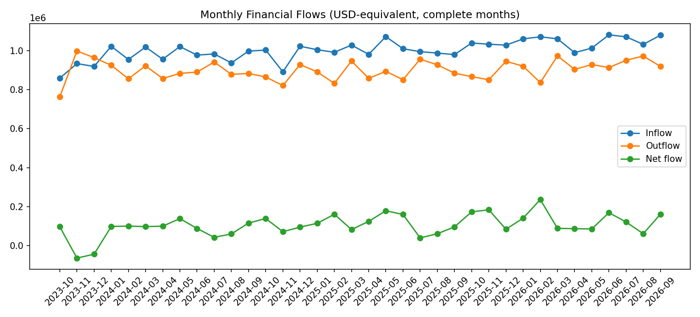
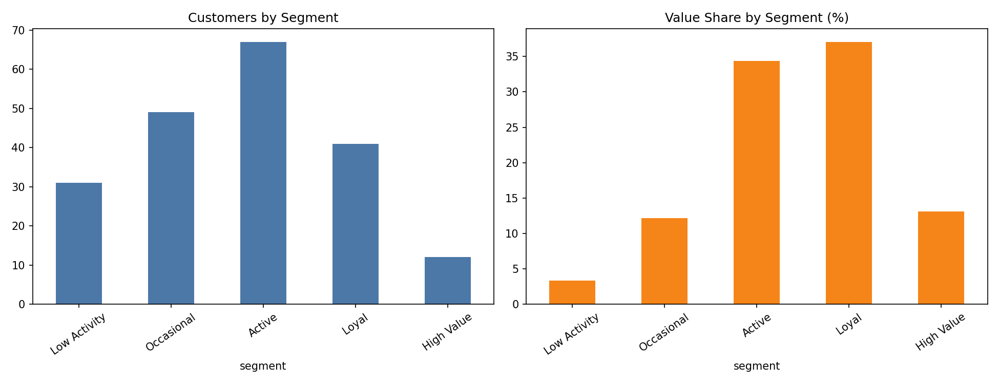

# Financial Customer & Transaction Analytics

> ⚠️ **All results are based on SYNTHETIC data** (public `synthetic-bank-dataset` generator, 200 customers, 476,202 transactions). They demonstrate the analysis workflow only and say nothing about a real bank. See `data/raw/SOURCE.md`.

End-to-end financial data analysis using Python, statistics, visualization, and SQL. The project is descriptive/diagnostic; it does not claim to detect fraud or replace a production risk system.

## Highlights

| Area | What is included |
|---|---|
| Data | 7 source tables (customers, accounts, transactions, cards, loans, merchants, subscriptions) + 2 derived reference tables |
| Cleaning | Duplicate removal, key and relationship checks, **currency normalization to USD-equivalent** |
| Analysis | Customer / transaction / financial KPIs, monthly trends, RFM segmentation, robust anomaly screening |
| SQL | 3 DuckDB-compatible query files, executed by `scripts/run_sql.py` |
| Report | `reports/business_insights.md` - generated from the CSV outputs, never hand-typed |
| QA | `scripts/validate_project.py` checks values and reconciliations, not just file existence |




## Interactive dashboard

```bash
python -m streamlit run app/dashboard.py
```

Five tabs: Overview, Trends, Customers (RFM), Anomalies, Data & limitations, with currency and partial-month filters. It reads only small aggregates from `data/dashboard/` (committed to the repo, built by `scripts/build_dashboard_data.py`), so it works from a fresh clone without the raw data. It can be deployed for free on Streamlit Community Cloud (main file: `app/dashboard.py`).

## Repository layout

```text
data/raw/          Source CSV files (not committed)
data/reference/    Illustrative FX rates (committed)
data/dashboard/    Small aggregates feeding the dashboard (committed)
app/               Streamlit dashboard
data/processed/    Cleaned and final datasets (not committed)
notebooks/         Numbered analysis workflow (01-08)
sql/               DuckDB/PostgreSQL-style analysis queries
scripts/           Pipeline, visualizations, report generator, SQL runner, QA
visualizations/    Exported charts (not committed; featured ones in docs/images/)
reports/           Business report + data dictionary
```

## Quick start

```bash
python -m venv .venv
# Windows PowerShell
.\.venv\Scripts\Activate.ps1
pip install -r requirements.txt
python scripts/run_pipeline.py
```

The pipeline runs all notebooks, SQL, charts, the report, and the final QA, without opening Jupyter.

To rebuild the raw data: `python scripts/generate_sample_data.py` (small demo set) or place the files from the synthetic generator in `data/raw/` (see `data/raw/SOURCE.md`).

## Key methodology decisions

- **Currency**: the source mixes USD, GBP and EUR. Native amounts are never summed together; every value KPI uses `amount_usd` (fixed *illustrative* rates in `data/reference/fx_rates.csv`). With real data, use dated market rates.
- **Flows**: fees are separate from withdrawals; internal transfers (two offsetting legs) are excluded from total transaction value and reported separately.
- **Partial month**: the final month is flagged (`is_partial_month`) and excluded from trends and growth rates.
- **Anomalies**: robust z-score of log(amount) within each customer × category, plus a per-customer daily-frequency rule; recurring subscriptions, salary, and transfers are excluded. Output is a *screening list* (~2% of rows), ranked by score - not a fraud rate.
- **Status**: the source has no status field, so `Completed` is an explicit assumption.

## Analytical guardrails

- A potentially anomalous transaction is not necessarily fraudulent.
- Keep transaction count and transaction value distinct.
- Do not mix failed/reversed/pending transactions into completed flows without a documented rule.
- Segmentation thresholds are quintile-based for this demo and must be recalculated for real data.
